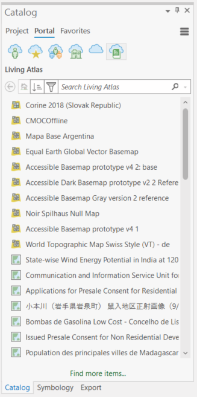
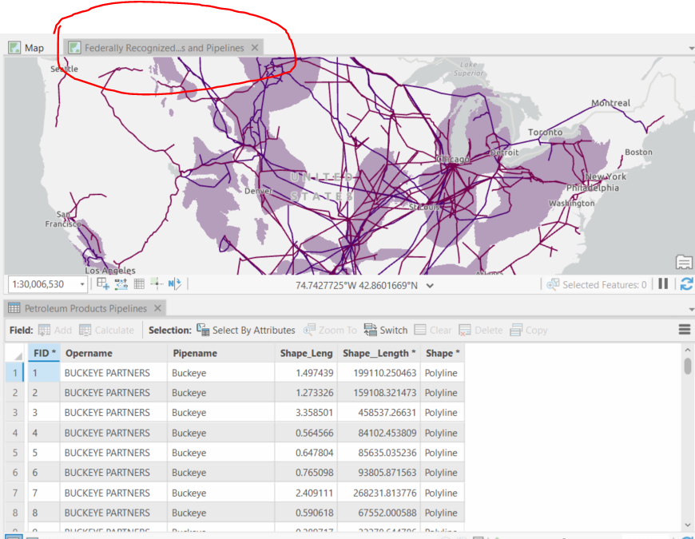
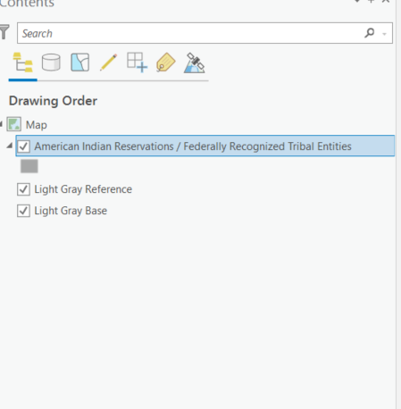
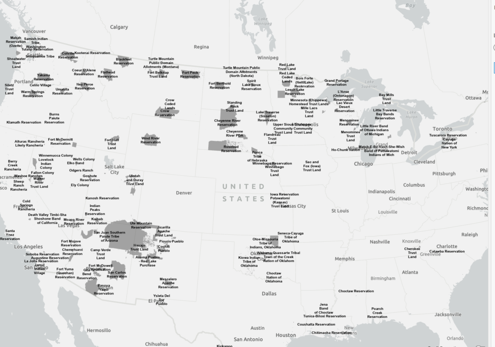

# ArgGIS Tutorials #

## What is GIS? ##
A geographic information system is used to display various types of data within a map-like format. GIS can connect various types of local data that display the physical geographical locations, as well as additional descriptions. 
## ArcGIS Online ##
Is a cloud-based software that allows you to build interactive visual maps. This is Esri’s web-based mapping platform. You will need a License through ArcGIS in order to use it and thankful we have access to ArchGIS through Penn State!

## ArcGIS Pro ##
This is Esri’s desktop application for ArcGIS. Please keep in mind the ArcGIS was made for Windows, not Macs. 

## How to Create an Account and Download ArcGIS Pro: ##
1. Go to [ArcGIS Online](https://www.esri.com/en-us/arcgis/products/arcgis-online/overview) and click the Sign In button.
2. You will want to sign with the ArcGIS Organization’s URL section.
    1. You will want to type in the word pennstate
    2. Now this will take you to the Penn State login page. This page will prompt you to login in with your PSU account.
3. Once you are logged into your ArcGIS account that is registered through Penn State go to the top right hand corner of your screen and click your account tab. Once the drop menu is open, click the My settings section.
4. Then you will want to click the Licenses tab near the top left corner of your webpage.
5. Here you will see all Licenses Penn State has to offer for any PSU students that want to use ArcGIS.
6. Scroll down and find the ArcGIS Pro License click the download link. Once the download has completed, click and open the downloaded ArcGIS file.
    1. You will have a pop-up window that will guide you through a series of steps for the installation process.
    2. Choose the desired destination where you would like to keep your ArcGIS desktop program. Then press the Next button.
7. After the extraction process is completed make sure the *Launch the setup program* box is checked. :heavy_check_mark: 
8. Then press the Close button.
## How to Create a New Map Project: ##

This section of the tutorial is to familiarize yourself with the different sections and panes within ArcGIS Pro. First load up your ArcGIS Pro desktop application. Create a new Map project and save it within your desired file directory. Please take note that ArcGIS Pro has a user interface that looks very similar to Microsoft Word. 

Once the project is opened you will notice that a base map of the United States is displayed.

Tools and Commands are located within the Top panel of the window. There are various tools and commands used for different tasks. Most of the tools we will be using are located on the Map tab due to the fact we create a new map project. 

There is a Contents pane located on the left side of the window. The Contents pane shows you the active content currently being seen in the active View Pane. This displays the drawing order of the different map layers within a hierarchical format. 

There is a Catalog pane located on the right side of the window. This pane allows the user to access items of your project disk or through your portal. Using the Portal tab can be very useful to find various datasets from ArcGIS Online and Living Atlas geodatabases. 

## How to Look up Data within Living Atlas: ##
First let's use the Basemap tool in the top panel to change the base style of our Map. Select the *Light Gray Canvas setting*

Now we are going to add a layer that represents the physical Native American Reservation boundaries within the United States. Navigate to the Catalog Pane and Click the Portal tab, hover over the cloud-like symbols and select the symbol that says Living Atlas. 

Type this statement within the search bar **Federally Recognized Tribal Reservations vs Oil/Petroleum/Coal Locations and Pipelines**. You will notice after your search that you got one result, please right click on the result and click the Add and Open option.This might take a few minutes to load. 

You will notice that you have another map added to your project. Please click on the tab next to your personal map.

Navigate to the Contents pane and find the layer labeled **American Indian Reservations / Federally Recognized Tribal Entities**. Right the layer and copy paste it into your personal map sheet in the Contents Pane.  

Make sure that the layer you copied is at the top of the Drawing Order. Use these photos as reference.

This is what your map should look like so far.

## Formatting Data for ArcGIS: ##
## Adding Data to your Map: ##
## Display Data and Tables on your Map: ##

