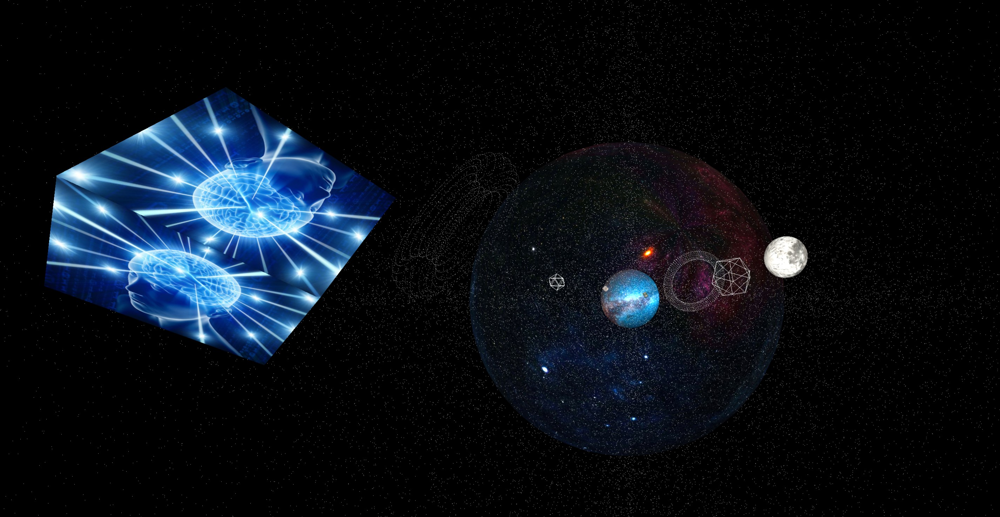
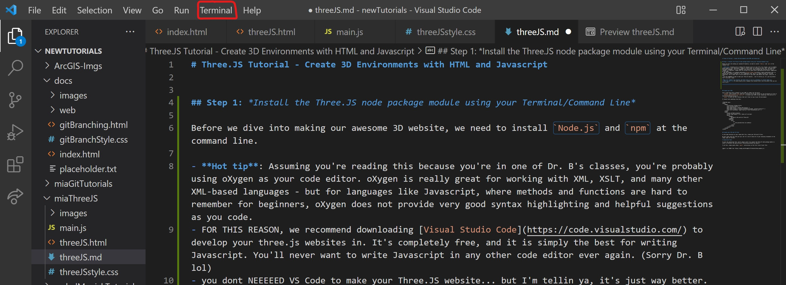

# Three.JS Tutorial - Create 3D Environments with HTML and Javascript



Check out an example:
[Three.js Blog](https://am0eba-byte.github.io/internshipblog-3js/)

See other awesome things you can do with three.js:
[Three.JS examples page](https://threejs.org/examples/#webgl_animation_keyframes)

## Step 1: *Install the Three.JS node package module using your Terminal/Command Line*

Before we dive into making our awesome 3D website, we need to install `Node.js` and `npm` at the command line.

- **Hot tip**: Assuming you're reading this because you're in one of Dr. B's classes, you're probably using oXygen as your code editor. oXygen is really great for working with XML, XSLT, and many other XML-based languages - but for languages like Javascript, where methods and functions are hard to remember for beginners, oXygen does not provide very good syntax highlighting and helpful suggestions as you code.
- **FOR THIS REASON**, we recommend downloading [Visual Studio Code](https://code.visualstudio.com/) to develop your three.js websites in. It's completely free, and it is simply the best for writing Javascript. You'll never want to write Javascript in any other code editor ever again. (Sorry Dr. B lol)
- you dont *neeeeed* VS Code to make your Three.JS website... but I'm tellin ya, it's just way better. You'll see what I mean.

### **Install Node.js**

Node.JS is what makes the Javascript world go round. 

"As an asynchronous event-driven JavaScript runtime, Node.js is designed to build scalable network applications." *-Node.JS devs*

Before downloading Node.JS, you should check to see if you already have it installed in your machine.
To do this, we will open our Command Line.

- **Hot tip part 2:** VS code actually has a command line terminal built into the editor that you can use as well:



- Enter this command to check if you already have Node.JS Installed:
  ```
    node -v
  ```

 If you already have Node.JS installed, the terminal will print a version number that looks something like this: `v0.10.35`

 If your terminal didn't print a version number, you need to go [download Node.JS](https://nodejs.org/en/). (Don't worry, it's completely free - and if you really want to get into Javascript on any level, including professionally, Node.JS is a must-have.)

 ### **Install NPM**

Now that you have Node.JS installed, allow me to introduce you to the wonderful world of the **[Node Package Manager (NPM)](https://www.npmjs.com/)** community. NPM allows brilliant developers to write awesome open-source Node.JS package modules that will allow you to do super cool things with Javascript, including make 3D websites. We need to install NPM at the command line in order to install the Three.JS package.

- First, check to see if you already have NPM installed:

```
npm -v
```

Again, similar to when we checked for node.js, a version number will print if you already have npm installed. 
- If not, you need to install it. We can do this at the command line with this command:

```
npm install -g npm
```

Now you're all set to create your new project repository!

### **Create an empty project directory, and install THREE.js**

Once you have made your project directory, open the command line at your empty directory and enter this command:

```
npm install --save three
```

You should see a new `node_modules` directory, a `package.json` file, and a `package-lock.json` file. 

- **DO NOT TOUCH THESE THINGS**

These files and directory contain dependencies that NPM automagically generates for you. Humans do not need to touch them directly, and should never touch them for any reason at all - *or you'll destroy the planet*


## Create your HTML

You'll need three basic elements in your HTML to render your 3D world:
- `<canvas>` with a unique `@id` that will literally act as the canvas for your 3D objects to live in.
- `<script type="module" src="./main.js">` to connect your HTML to your Javascript file with all fo the 3D instructions inside it.
- `<main>` to hold the text contents that will float on top of your 3D environment.

It should look something like this:

```
<!DOCTYPE html>
<html>
    <head>
        <title>Three JS Demo</title>
        <meta charset="UTF-8" />
        <meta name="author" content="Mia Borgia" />
        <meta name="viewport" content="width=device-width, initial-scale=1.0" />
        <link rel="stylesheet" type="text/css" href="threeJSstyle.css" />
    </head>
    <body>
        <canvas id="bg"></canvas>
        <script type="module" src="./main.js"></script>
        <main>
            <header>
                Welcome to the world of Three.JS!
            </header>
            <section>
                <div>
                    <p>
                        The possibilities are endless! 
                    </p>
                </div>
            </section>
        </main>
    </body>
</html>
```

## Create your CSS and JS files

In the same directory as your index.html file, create your CSS and JS files. 

We won't mess with your CSS just yet, but it's nice to have all of your necessary documents at the ready right off the bat.

# Javascript Time!

In your new javascript file, you'll need to tell it to import the Three.JS node package module in order to reference the many pre-built 3D-building methods and objects.

To do this, simply paste these `import` instructions on the first line of your JS file:

```
import * as THREE from 'https://unpkg.com/three@0.127.0/build/three.module.js';
```

## Scene Setup

[Helpful Three.JS documentation in case you need it](https://threejs.org/docs/index.html#manual/en/introduction/Creating-a-scene)

You need three main components to set up your Three.JS scene:

- a new scene
- a camera
- a renderer

We create these objects by declaring a new `const`, a type of variable in Javascript, and defining it with new THREE methods.

```
// Setup

const scene = new THREE.Scene();

const camera = new THREE.PerspectiveCamera(75, window.innerWidth / window.innerHeight, 0.1, 1000);


// create a new renderer by instating the canvas element in our HTML // file
const renderer = new THREE.WebGLRenderer({
  canvas: document.querySelector('#bg'),
});
```

You will not be able to view your new scene until you tell the renderer to render the scene and the camera with Three.js's `.render` method:

```
renderer.render(scene, camera);
```


Now that we have each of these objects set as constants, we can manipulate them with Three.JS's built-in methods. 

Let's set the pixel ratio, the size, and the camera position:

```
renderer.setPixelRatio(window.devicePixelRatio);
renderer.setSize(window.innerWidth, window.innerHeight);
camera.position.setZ(50);
camera.position.setX(-3);

```


## Create your first object!

Now that our scene is set up, we can add 3D objects! 

There are three basic components you need in order to create a 3D object in Three.JS:

- the geometry
- the material
- the mesh (combining the geometry and the material)

We need to create new `const` variabels for each of these components so that we may manipulate them and add the final mesh to our scene.

Let's create a basic cube.

```
const geometry = new THREE.BoxGeometry();

//set the color of the basic material in the object parameters `{}`
const material = new THREE.MeshBasicMaterial( { color: 0x00ff00 } );

const cube = new THREE.Mesh( geometry, material );
```

To add our cube into the scene, use the `.add()` method.

```
scene.add( cube );
```

## Manipulating your object

You can change the position of the object by manipulating the cube's `.position` property and attaching the axis on which you want to move it:

```
cube.position.z = 5;
```

Change the rotation of your object by manipulating the `.rotation` property and attaching the axis on which you wish to rotate it:

```
cube.rotation.x = 2;
cube.rotation.y = .5;
```

## Lights and Material Types

Three.JS allows you to create objects with a wide variety of customizable material types and textures. Some material types require lights in the scene in order to be visible, including the `Phong` material. Your cube is visible because it is made of a `Basic` material, which is not affected by lights.

Let's create a new object to test out new materials:

```
const ico = new THREE.IcosahedronGeometry(10);
const icoMaterial = new THREE.MeshPhongMaterial({ color: 0x00ff00 });
const icoMesh = new THREE.Mesh(ico, icoMaterial);

scene.add(icoMesh);

icoMesh.position.z= 10;
icoMesh.position.x= 10;
```

If you try to view your new object in the browser, you will not be able to see it. Since Phong materials require light, you will need to at least one light object in your scene:

```
// Lights

const pointLight = new THREE.PointLight(0xffffff);
pointLight.position.set(25, -15, 560);

const ambientLight = new THREE.AmbientLight(0xffffff);

scene.add(pointLight, ambientLight);
```

- Point Lights are lights that only go in one direction.

- Ambient lights act more like the sun, spreading light in all directions. 

- You can change the color of the light by manipulating the HEX code value of the new THREE.Light() object within the parentheses.


# Animate your scene

To make your objects move through time, we need to create a new `animate` function and set our animation properties within it.

You can animate just about any property of an object you want.

```
function animate() {
	requestAnimationFrame( animate );

    // slowly rotate the cube:

    cube.rotation.x += 0.01;
    cube.rotation.y += 0.01;

    // rotate the icosahedron a little faster in the opposite direction:

    icoMesh.rotation.z += -0.03
    icoMesh.rotation.y += -0.03

	renderer.render( scene, camera );
}
```

You must call the animate() function in order to tell the browser to use it:
```
animate();
```


